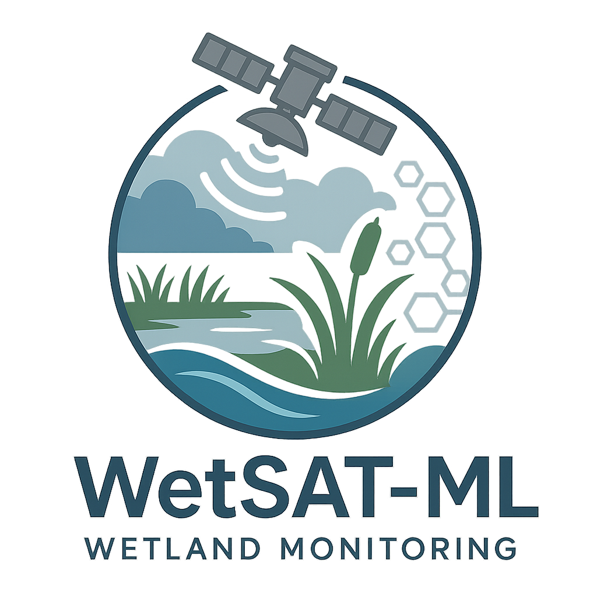

<!-- README.md is generated from README.Rmd. Please edit that file -->

# WETSAT



<!-- badges: start -->
<!-- badges: end -->

In response to the growing global demand for wetland data, and building
on SEI-Latin America’s previous work, this project aims to develop the
WetSAT-ML (Wetlands flooding extent and trends using SATellite
observations and Machine Learning) tool. It consists of an open-source
algorithm integrated with Google Earth Engine’s cloud platform and
databases. The tool will process radar satellite data from the
Sentinel-1 mission to generate wetland flooding extent maps, water
permanence maps, and quantify key hydrological parameters, including
flooded area time series, hydroperiods, and intra- and inter-annual
wetland area trends.

## Installation

You can install the development version of WETSAT from
[GitHub](https://github.com/), using these commands:

``` r
# install.packages("devtools")
# devtools::install_github("dazamora/WETSAT")
```

## Concepts behind WETSAT tool

## WETSAT tool functions

## Example

This is a basic example which shows you how to solve a common problem:

``` r

## basic example code
```

What is special about using `README.Rmd` instead of just `README.md`?
You can include R chunks like so:

``` r
summary(cars)
#>      speed           dist       
#>  Min.   : 4.0   Min.   :  2.00  
#>  1st Qu.:12.0   1st Qu.: 26.00  
#>  Median :15.0   Median : 36.00  
#>  Mean   :15.4   Mean   : 42.98  
#>  3rd Qu.:19.0   3rd Qu.: 56.00  
#>  Max.   :25.0   Max.   :120.00
```

You’ll still need to render `README.Rmd` regularly, to keep `README.md`
up-to-date. `devtools::build_readme()` is handy for this.

You can also embed plots, for example:

## Datasets

## Disclaimer

## References
