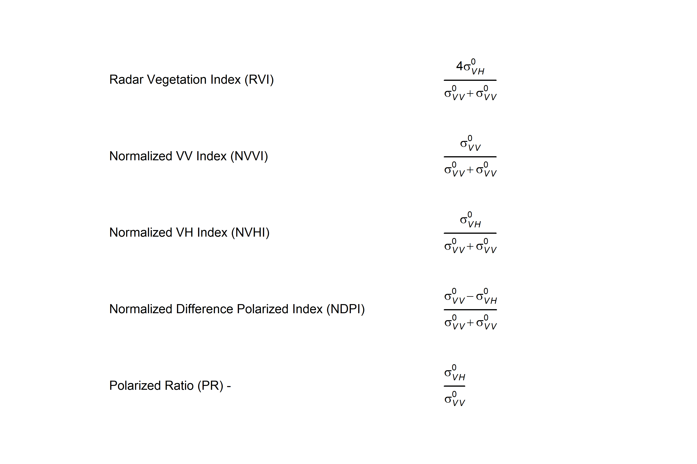

<!-- README.md is generated from README.Rmd. Please edit that file -->

# WetSAT-ML

<!--  **W**etlands flooding **e**xtent and **t**rends using **SAT**ellite data and **M**achine **L**earning 
Esta linea es un ensayo para incluir el logo al lado del título
-->
<table>
<tr>
<td>

</td>
<td style="vertical-align: middle; padding-left: 18px;">
<span style="font-size: 20px;"> <strong>W</strong>etlands flooding
<strong>e</strong>xtent and <strong>t</strong>rends using
<strong>SAT</strong>ellite data and <strong>M</strong>achine
<strong>L</strong>earning </span>
</td>
</tr>
</table>
<!-- El siguiente fragmento es para incluir la imagen del logo grande en el readme, lo tengo comentado porque lo incluí arriba en el titulo

 -->

# METHODOLOGY


<!-- badges: start -->
<!-- badges: end -->

In response to the growing global demand for wetland data, and building
on SEI-Latin America’s previous work, this project aims to develop the
WetSAT-ML (Wetlands flooding extent and trends using SATellite
observations and Machine Learning) tool.

## Installation

You can install the development version of WETSAT from
[GitHub](https://github.com/), using these commands:

``` r
# install.packages("devtools")
# devtools::install_github("dazamora/WETSAT")
```

## Concepts behind WETSAT tool

The tool processes radar satellite data from the Sentinel-1 mission to
generate wetland flooding extent maps, water permanence maps, and
quantify key hydrological parameters, including flooded area time
series, hydroperiods, and intra- and inter-annual wetland area trends.
The algorithm will use machine learning models to characterize the
scattering behavior of the radar signal for different wetland flooding
conditions, enabling a pixel-level water detection in the satellite
images Huang et al. (2018).

In this study we not only included the backscatter observations from VV
and VH channels but also the indices



## WETSAT tool functions

WETSAT package contains XX functions, most of them have a practical
example about their usage. The functions are:

- `radar_index_stack`: XXXXXX
- `train_rf_model`: XXXXXX
- `classify_water_surface`: XXXXXX
- `performWS`: XXXXXX

## Dataset

The Everglades region is located in southern Florida, and it extends
over an area of 9,150 km2 from the margin of Florida Bay in the south to
the Everglades Agricultural Area (EAA) in the north (Figure 1). The area
supports a diverse mosaic of different wetlands, including freshwater
marshes, swamps, sloughs, and wet prairies (Figure 1a). The area also
presents diverse vegetation communities where the sawgrass (especially
Cladium jamaicense) is the most abundant, interspersed with patches of
shrubs with a mix of swamp and bayhead shrub species, and trees with a
mix of swamp, hammock, and bayhead tree species *Palomino-Ángel,
Wdowinski, and Li (2024)*.


## Example

This is a basic example which shows you how to solve a common problem:

``` r

## basic example code
```

What is special about using `README.Rmd` instead of just `README.md`?
You can include R chunks like so:

``` r
summary(cars)
#>      speed           dist       
#>  Min.   : 4.0   Min.   :  2.00  
#>  1st Qu.:12.0   1st Qu.: 26.00  
#>  Median :15.0   Median : 36.00  
#>  Mean   :15.4   Mean   : 42.98  
#>  3rd Qu.:19.0   3rd Qu.: 56.00  
#>  Max.   :25.0   Max.   :120.00
```

You’ll still need to render `README.Rmd` regularly, to keep `README.md`
up-to-date. `devtools::build_readme()` is handy for this.

You can also embed plots, for example:

## Datasets


## Disclaimer

## References

<div id="refs" class="references csl-bib-body hanging-indent"
entry-spacing="0">

<div id="ref-rs10050797" class="csl-entry">

Huang, Wenli, Ben DeVries, Chengquan Huang, Megan W. Lang, John W.
Jones, Irena F. Creed, and Mark L. Carroll. 2018. “Automated Extraction
of Surface Water Extent from Sentinel-1 Data.” *Remote Sensing* 10 (5).
<https://doi.org/10.3390/rs10050797>.

</div>

<div id="ref-palomino2024" class="csl-entry">

Palomino-Ángel, Sebastián, Shimon Wdowinski, and Shanshan Li. 2024.
“Wetlands Water Level Measurements from the New Generation of Satellite
Laser Altimeters: Systematic Spatial-Temporal Evaluation of ICESat-2 and
GEDI Missions over the South Florida Everglades.” *Water Resources
Research* 60 (3): e2023WR035422.
https://doi.org/<https://doi.org/10.1029/2023WR035422>.

</div>

</div>
